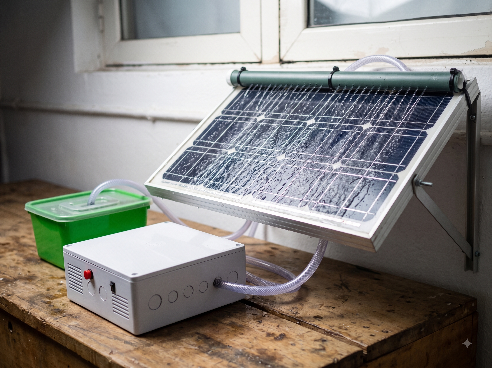
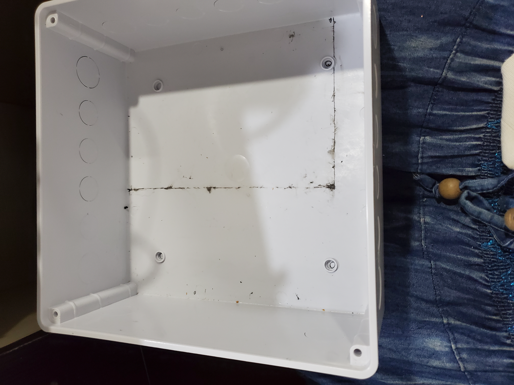

<p align="center">
  
</p>

<h1 align="center">☀️ Clear Panel IoT: Automated Solar Panel Cleaning System</h1>

<p align="center">
  <strong>An IoT-enabled, self-contained automated cleaning system for residential solar panels</strong><br>
  Built with an ESP32, 12V diaphragm pump, HiveMQ secure cloud routing, and a bilingual web dashboard — built at RAIN, Ibadan.
</p>

<p align="center">
  
  
  
  
</p>

<p align="center">
  <a href="https://clear-panel-iot.netlify.app"><strong>🖥️ Live Dashboard</strong></a> &nbsp;·&nbsp;
  <a href="https://www.linkedin.com/posts/salimat-akinwande_robotics-iot-womeninstem-activity-7489415576440958976-GQpV"><strong>📝 Project Story (LinkedIn)</strong></a> &nbsp;·&nbsp;
  <a href="https://salimahh.github.io"><strong>🌐 Portfolio</strong></a>
</p>

---

## 📌 The Problem: Why Clean Panels Manually?

<p align="center">
  
</p>

If you have ever watched dust slowly choke the output of a solar panel, you know the frustration. In environments prone to dust and particulate accumulation, efficiency drops drastically in weeks.

The traditional solution? Someone climbs onto the roof with a sponge, a bucket of water, and a brush. It is tedious, dangerous, and completely impractical for daily maintenance.

**Clear Panel IoT** removes the human element from the roof. It is a low-cost, automated washing system controlled right from your smartphone or set to run on a routine schedule, keeping photovoltaic cells operating at peak efficiency without risking anyone's safety.

---

## 🎯 Core Objectives

- ✅ **Physical Compartmentalization:** Isolate high-pressure fluid dynamics from sensitive 3.3V/5V microcontroller electronics inside a weather-resistant enclosure.
- ✅ **Secure IoT Architecture:** Migrate from unencrypted public brokers to enterprise-grade HiveMQ TLS cloud routing.
- ✅ **Offline Redundancy:** Design a non-blocking physical manual override button that operates the system instantly even if the Wi-Fi drops.
- ✅ **Bilingual Progressive Web App:** Deploy a Netlify-hosted dashboard featuring real-time status toggles in English and Yorùbá, backed by Supabase logging.
- ✅ **Safety Automation:** Program a strict 30-second auto-off timer to prevent pump burnout and water wastage.

---

## 🏗️ System Architecture

```
┌─────────────┐       MQTT (wss://)      ┌──────────────┐      GPIO 18       ┌─────────────────┐
│  Netlify    │ ───────────────────────► │    ESP32     │ ─────────────────► │  1-Channel Relay │
│  Dashboard  │ ◄─────────────────────── │   (Brain)    │                    │  & 12V Pump      │
└─────────────┘         Telemetry        └──────┬───────┘                    └─────────────────┘
                                                  │
                                                  │ GPIO 19 (INPUT_PULLUP)
                                                  ▼
                                          ┌──────────────┐
                                          │ Physical     │
                                          │ Push Button  │
                                          └──────────────┘
```

---

## ⚙️ Hardware Stack

| Component | Spec | Role |
|-----------|------|------|
| ESP32 DevKit V1 | Dual-core Wi-Fi/BLE SoC | Main control brain & MQTT client |
| 12V 60W Diaphragm Pump | High-pressure miniature pump | Water delivery & kinetic spray |
| 1-Channel Relay Module | Optocoupled, Active-LOW | Switching high current safely |
| 18650 Li-ion Battery Pack | 15.6V supply | Independent system power |
| Custom PVC Pipe Array | Hand-drilled jet configuration | Water distribution across panel |
| Weatherproof Enclosure | IP-rated plastic box | Physical housing & compartment divider |

---

## 🧱 The Build Journey: From Casing to Code

Building a physical hardware project that combines water and electricity is never a straight line. Here is how the physical enclosure evolved:

<p align="center">
  
  
  
</p>

1. **The Empty Enclosure:** Started with a blank IP-rated box. The biggest danger was water splashing near the electronics.
2. **Building the Partition:** Fabricated an internal acrylic/foam divider to permanently separate the wet pump chamber from the dry micro-controller perfboard compartment.
3. **Upgrading the Hardware:** Transitioned from a weak submersible pump to a high-pressure 12V diaphragm pump, powered by an 18650 battery bank and stepped down via a buck converter.

### 3D Enclosure Design
Before cutting and drilling, the physical layout was prototyped in CAD:


https://github.com/user-attachments/assets/0b66bc97-cf5d-4089-9b62-c6fb6f370b95


---

## 🔌 Circuit Schematic

The circuit was simulated and mapped out to ensure proper voltage isolation between the high-current pump circuit and the ESP32 logic pins.

<p align="center">
  
</p>

---

## 💻 Firmware Highlights

### 1. Non-Blocking Wi-Fi & Manual Override
If an IoT device loses connection and uses a blocking `while()` loop to reconnect, physical buttons become completely useless. This code uses non-blocking millis() timing so the manual override button responds instantly.

```cpp
// Physical manual override button check
int reading = digitalRead(BUTTON_PIN);
if ((millis() - lastDebounceTime) > debounceDelay) {
    if (reading == LOW) { // Button pressed down
        isSystemOn = !isSystemOn;
        setPumpState(isSystemOn);
        if (client.connected()) client.publish("solar/pump/status", isSystemOn ? "ON" : "OFF");
    }
}
```

### 2. Secure HiveMQ Cloud Integration
Unlike the resource-constrained ESP8266 which choked on TLS handshakes, the ESP32 effortlessly utilizes `WiFiClientSecure` to maintain an encrypted, enterprise-grade connection over port 8883.

---

## 🛠️ Challenges & What I Learned

- **The Frying Pan Moment:** Early on, incorrect tuning of the buck converter sent an unmanaged voltage spike straight into the logic board, instantly frying the microcontroller. Lesson: Always double-check multimeter readings before powering sensitive ICs.
- **Back-EMF and Power Dips:** When the 12V relay switched the pump on, the sudden current draw caused a micro-brownout that momentarily flickered the status LED. Adding optocoupled isolation and proper power zoning stabilized the logic rail.
- **Fluid Dynamics:** Hand-drilling PVC pipe holes taught me real-world pressure distribution. Water naturally exits the first few holes due to path of least resistance. Restricting downstream flow allowed uniform pressure across all jet ports.

---

## 🚀 Live Demonstration at RAIN

A compilation video showcasing the live IoT trigger and physical pump spray during presentation at Robotics and Artificial Intelligence Nigeria (RAIN) will be added here shortly.

---

## 🔭 Future Scope

| Feature | Description |
|---|---|
| Ultrasonic Reservoir Sensor | HC-SR04 sensor to monitor water tank depth and update the web digital twin. |
| Battery Telemetry | Voltage divider circuit to track 18650 battery percentage live on the dashboard. |
| Automated NTP Scheduling | Syncing the ESP32 internal clock to trigger scheduled washes without manual clicks. |

---

## 👩🏾‍💻 Built By

**Salimat Oluwatobi Akinwande**
Electronic & Electrical Engineering (First Class), LAUTECH
Robotics Development & Automation Fellow — RAIN RDA Cohort 18, Ibadan

[Portfolio](https://salimahh.github.io) · [LinkedIn](https://www.linkedin.com/in/salimat-akinwande) · [GitHub](https://github.com/Salimahh)

Built with real hardware, real mistakes, and real engineering lessons — at Robotics & Artificial Intelligence Nigeria (RAIN), Ibadan.
